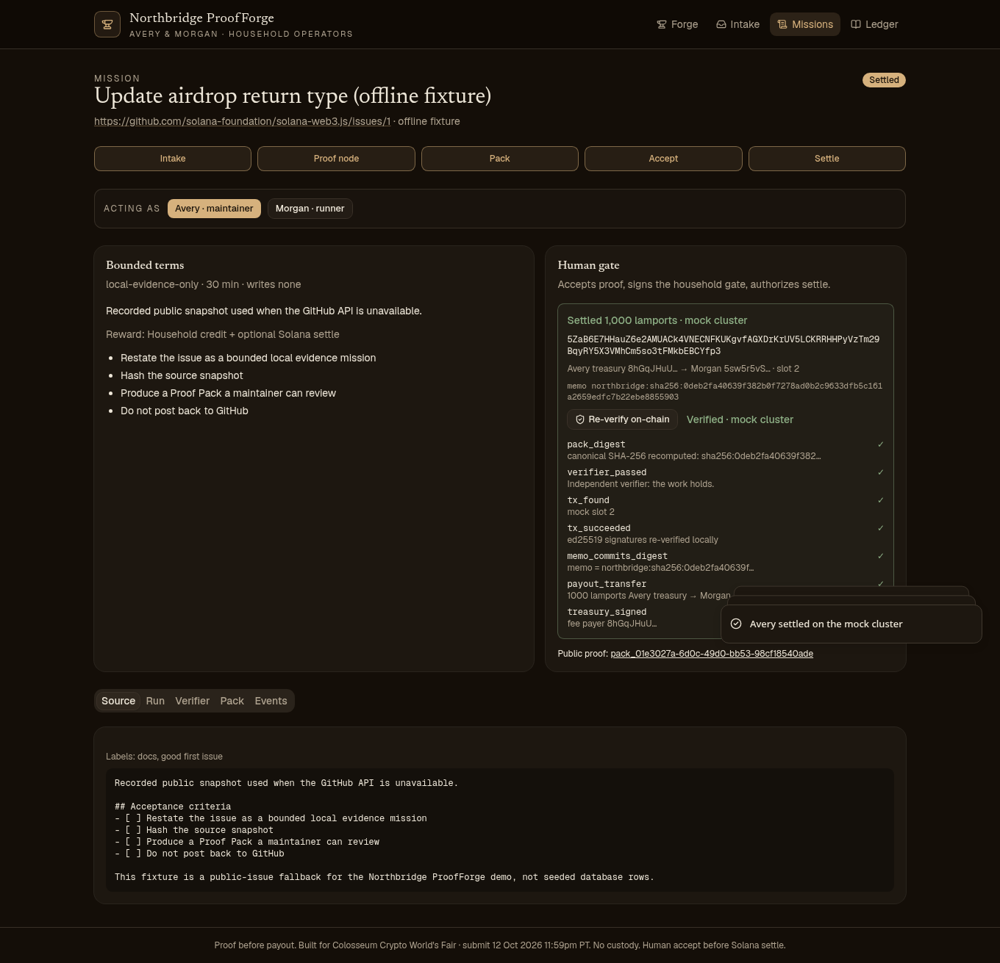
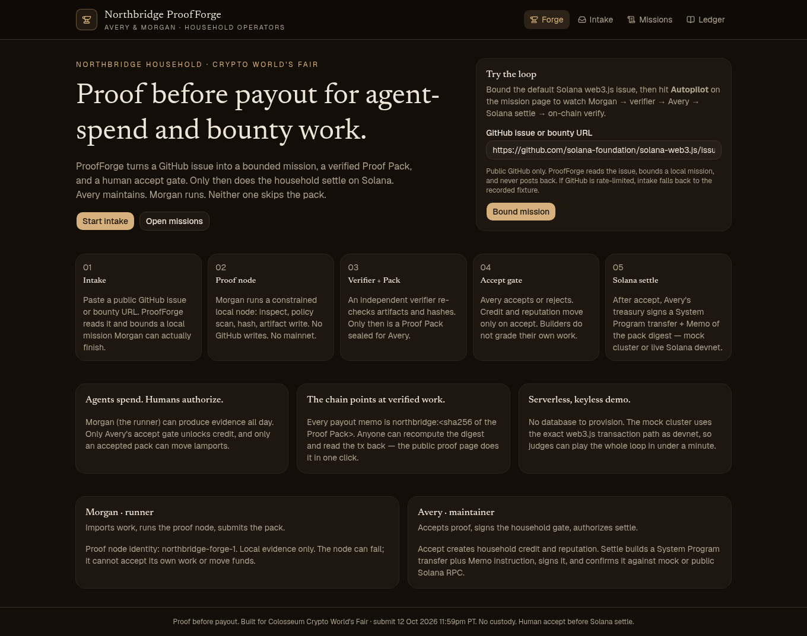
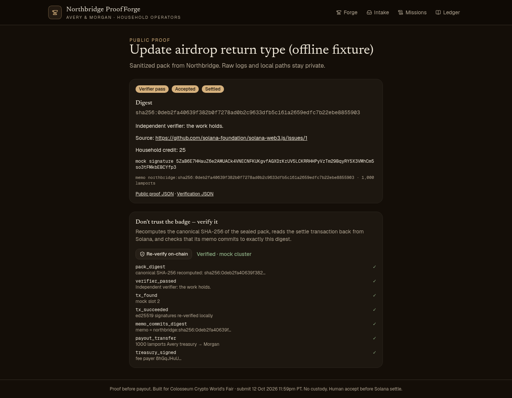
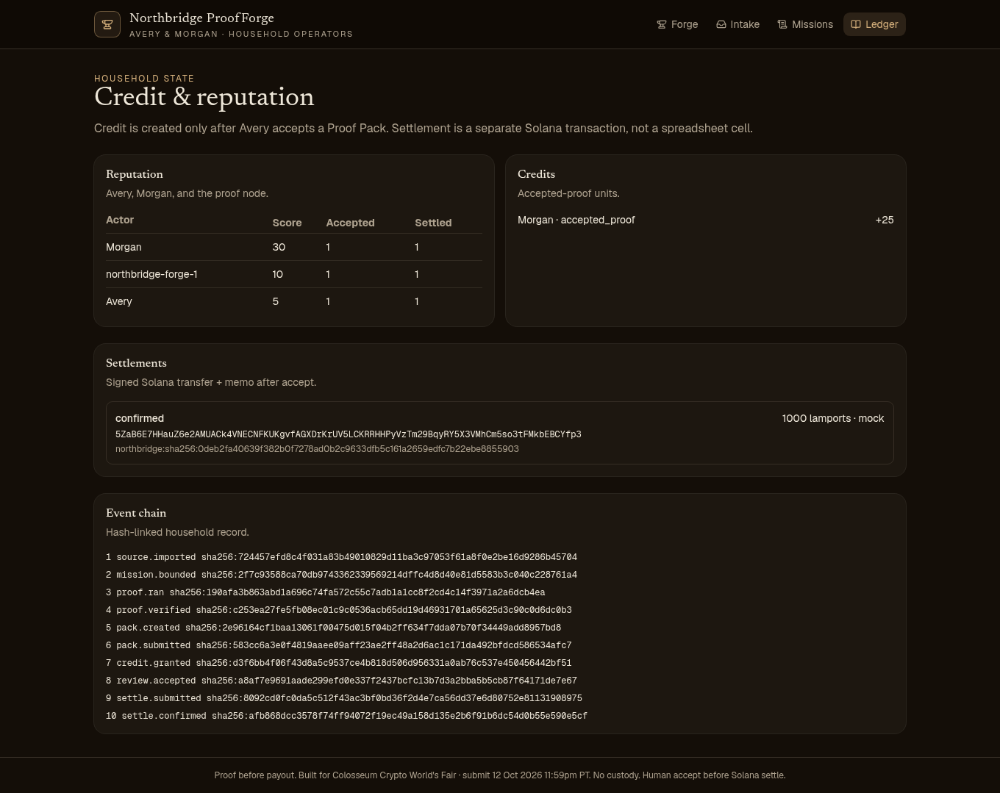

# Northbridge ProofForge

**Proof before payout — agent-spend and bounty work sealed, verified, then settled on Solana.**

> No proof, no credit. Builders do not grade their own work. No accept, no settle.

| | |
| --- | --- |
| **Live demo** | `https://<your-deployment>.vercel.app` — _placeholder until the Vercel deploy is claimed (see [DEPLOY.md](DEPLOY.md))_ |
| **Hackathon** | [Colosseum Crypto World's Fair](https://www.colosseum.com/hackathon) · Solana track · final submit **Mon 12 Oct 2026, 11:59 PM PT** |
| **Arena** | https://colosseum.com/arena/projects/proofforge |
| **Run it in 60 s** | `npm install && npm run demo` — no keys, no database, no network required |

ProofForge is operated by the **Northbridge** household: **Morgan** (runner) produces the work, **Avery** (maintainer) is the only one who can accept it and release funds.



---

## Why this matters

AI agents are starting to *spend* — bounties, API credits, contributor payouts. Today those payouts either skip review or live inside a custodial marketplace. Either way, the payment record on-chain says *"someone got paid"*, never *"for what, verified by whom"*.

ProofForge makes the payment point at the proof:

1. **Agents spend, humans authorize.** The runner (Morgan) can generate evidence all day. Only an independent verifier can seal it, and only the maintainer (Avery) can accept it. Credit moves on accept; lamports move only after accept.
2. **The chain commits to verified work.** Every payout is one Solana transaction: `SystemProgram.transfer` (Avery's treasury → Morgan) **plus** a Memo `northbridge:sha256:<Proof Pack digest>`, signed by the treasury.
3. **Anyone can check it.** The public proof page recomputes the canonical SHA-256 of the sealed pack and reads the transaction back from the cluster — memo, transfer, signer — in one click. *Don't trust the badge; verify it.*

No custody, no token, no GitHub spam, no self-grading.

## Judge quickstart (≈60 seconds)

**Hosted:** open the live demo → **Bound mission** (default is a public `solana-web3.js` issue) → on the mission page click **Autopilot: play the loop**. You will watch:

`Morgan runs proof node → independent verifier → Proof Pack sealed → submitted → Avery accepts (credit) → Avery settles on Solana → on-chain verification ✓✓✓`

Then click **Public proof** to see the sanitized proof page re-verify the transaction.

**Local:**

```bash
npm install
npm run demo        # CLI: full loop + on-chain verification printout
npm run dev         # UI at http://127.0.0.1:43173
```

Sample `npm run demo` output:

```text
pack     sha256:5fbe7ea053c38cfc3b465cc366f45488c33d5179c9b0b02c6ea50092895c4f1d
avery    accepted → accepted
settled  mock  1000 lamports  slot 2
sig      3qyYCS6Zw3Tu4TX2VdnR2vH6yKiUVXZ7niF6FjZftGaREcJLtFWdXg6efEZNqVsKAt5BsMtcwSMCa66XW7erGHdJ
memo     northbridge:sha256:5fbe7ea053c38cfc3b465cc366f45488c33d5179c9b0b02c6ea50092895c4f1d
verify   ✓ pack_digest          canonical SHA-256 recomputed
verify   ✓ tx_succeeded         ed25519 signatures re-verified locally
verify   ✓ memo_commits_digest  memo = northbridge:sha256:5fbe7ea0…
verify   ✓ payout_transfer      1000 lamports Avery treasury → Morgan
verify   ✓ treasury_signed      fee payer 8hGqJHuU…
The work holds. On-chain record matches the sealed pack.
```

## Mock ↔ live Solana

Settlement always goes through the **same `@solana/web3.js` code path**: build `Transaction` → `SystemProgram.transfer` + Memo → sign with the treasury keypair → `sendRawTransaction` → confirm.

| Mode | What happens | Needs |
| --- | --- | --- |
| **Mock cluster** (default) | web3.js `Connection` with an in-process JSON-RPC (`src/lib/solana/mock-rpc.ts`). It verifies ed25519 signatures, checks the blockhash it issued, charges fees, and moves balances. Labeled "mock cluster" everywhere in the UI. | nothing |
| **Live devnet** | Real Solana devnet (or testnet / custom RPC). Confirmation is HTTP-polled so it works inside serverless functions. Explorer link + on-chain verification via `getParsedTransaction`. | funded devnet payer: `npm run devnet:setup` locally or `SOLANA_PAYER_SECRET` on Vercel |

The mission page shows a **Settle target** toggle; the live option enables itself as soon as a payer is configured. CLI: `npm run demo:live`.

## Architecture

```text
GitHub issue / bounty URL
  │  intake (read-only GitHub API, bundled offline fixture fallback)
  ▼
policy scan ──► bounded mission (objective, acceptance, 30-min local-only bounds)
  │
  ▼  Morgan · runner
proof node ──► artifacts + SHA-256 hashes (source, policy, checklist, env, hashes.json)
  │
  ▼  independent verifier (re-hashes files, forbids self-grading, no network writes)
Proof Pack  northbridge.proofpack.v1  (canonical-JSON SHA-256 digest)
  │
  ▼  Avery · maintainer  (accept / reject gate)
credit + reputation  ──►  hash-linked event chain
  │
  ▼  Avery · settle
Solana tx: SystemProgram.transfer + Memo("northbridge:<digest>")   [mock | devnet]
  │
  ▼  anyone
/proof/<packId>  →  recompute digest + read tx back  →  ✓ verified
```

| Layer | File | Notes |
| --- | --- | --- |
| Intake | `src/lib/github/import.ts` | Public GitHub issues; https bounty URLs; bundled fixture when rate-limited |
| Policy / bounds | `src/lib/mission/policy.ts`, `bound.ts` | Blocks private-key & mainnet-fund asks; warns on auto-PR language |
| Proof node | `src/lib/proof/runner.ts` | Local evidence only, no GitHub writes |
| Verifier | `src/lib/proof/verifier.ts` | Re-hashes artifacts, checks source digest, forbids self-grading |
| Pack | `src/lib/proof/pack.ts` | `northbridge.proofpack.v1`, canonical JSON digest (`src/lib/hash.ts`) |
| Pipeline | `src/lib/pipeline.ts` | State machine: bounded → packed → submitted → accepted → settled |
| Settle | `src/lib/solana/settle.ts` | web3.js transfer + Memo (treasury listed as memo signer) |
| Mock cluster | `src/lib/solana/mock-rpc.ts` | JSON-RPC subset, also at `POST /api/solana-rpc` |
| On-chain verify | `src/lib/solana/verify-onchain.ts` | Digest recompute + tx readback, `GET /api/proof/<packId>/verify` |
| Store | `src/lib/store/` | One JSON document: file (local) · memory (Vercel) · Upstash Redis (durable). See [DB_SCHEMA.md](DB_SCHEMA.md) |
| Ledger | `src/lib/events/chain.ts`, `credit/reputation.ts` | Hash-linked events, credits, reputation, settlements |

Stack: Next.js 16 (App Router) · TypeScript · Tailwind v4 · shadcn/ui · `@solana/web3.js` · no native dependencies.

### API

| Method | Path | Who |
| --- | --- | --- |
| `POST` | `/api/missions` `{url}` | intake |
| `POST` | `/api/missions/:id/run` · `/submit` | Morgan |
| `POST` | `/api/missions/:id/review` `{decision, note}` | Avery |
| `POST` | `/api/missions/:id/settle` `{mode: "mock" \| "live"}` | Avery |
| `GET` | `/api/proof/:packId` · `/api/proof/:packId/verify` | public |
| `GET` | `/api/ledger` · `/api/health` | public |

## Screens

| Forge | Public proof | Ledger |
| --- | --- | --- |
|  |  |  |

## Judging narrative

- **Problem:** agent-spend and bounty payouts skip review; on-chain records say who got paid, not for what.
- **Insight:** put the verified work's digest *in* the payment, and gate the payment on a human accept.
- **Solana fit:** sub-second, sub-cent transactions make a per-proof payout + memo practical; the Memo program gives a native, indexable commitment; web3.js keeps the mock and live paths identical.
- **Trust model:** runner ≠ verifier ≠ approver. The verifier is independent code, the accept gate is a separate role, the chain is the public witness, and the proof page lets anyone re-check all three.
- **What's next:** SPL-token / USDC payouts, multisig (Squads) treasury for the accept gate, compressed proof receipts, and a GitHub App that links accepted packs back to issues — opt-in, never spam.

Demo script for video: [docs/DEMO_SCRIPT.md](docs/DEMO_SCRIPT.md). Submission field drafts: [docs/COLOSSEUM_SUBMISSION.md](docs/COLOSSEUM_SUBMISSION.md).

## Configuration

See [.env.example](.env.example). Defaults: mock cluster, 1000 lamports, file store locally / memory store on Vercel, no GitHub token.

## What this is not

- Not a marketplace, escrow, or token issuer.
- Not automatic GitHub PR spam — intake is read-only.
- Not mainnet custody — devnet/testnet keys only.
- Not a copy of proprietary agent runtimes. Architecture is informed by public proof-of-work / open-agent patterns and rewritten from scratch.

## License

MIT © Northbridge household
